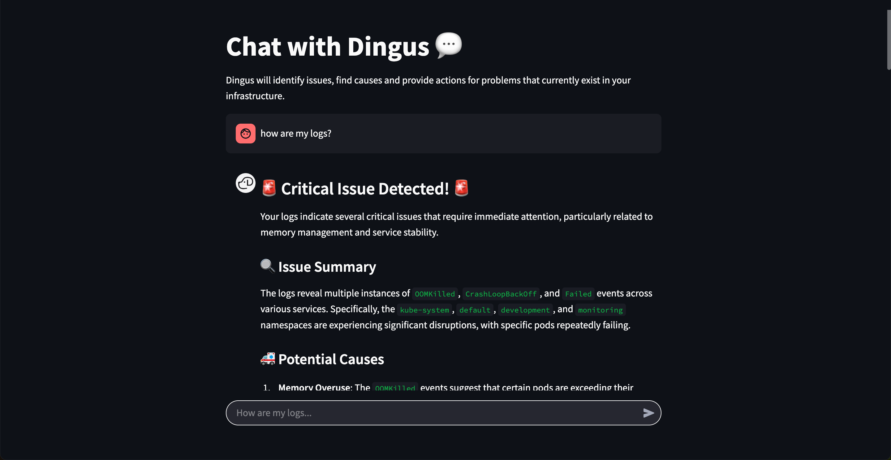

# 🚀 Chat with Logs 💬



## 🤖 AI-Powered Debugging for K8 & Loki _by [Dingus](https://www.dingusai.dev)_

Welcome to **Chat with Logs**, your intelligent debugging assistant designed for seamless **K8** & **Loki** integration! This tool analyses your **production logs**, detects critical issues, and suggests actionable fixes—helping you resolve problems faster and more efficiently.  

Whether you're a **lead engineer** troubleshooting production issues or a **hobbyist** debugging side projects, **Chat with Logs** empowers you with AI-driven insights to **accelerate incident resolution**.  


## 🛠️ Setup Guide  

### 1️⃣ Create Your `.env` File  

Before getting started, configure your environment variables and folders. Copy the sample configuration:  

```bash
mkdir logs data
cp sample.env .env
```

##### Configure Environment Variables  

These environment variables are essential for connecting **Chat with Logs** to **K8** & **Loki**, as well as enabling AI-powered log analysis. The remaining variables can be left as default (Note: if you are using linux, swap `http://host.docker.internal` with your host machine's local IP).

*If you do not wish to start with your Loki production logs, [use this simulation repository](https://github.com/dingus-technology/INFRASTRUCTURE-SIMULATION) for creating simulated logs locally*


| Variable Name        | Example Value           | Description                                                    |
| -------------------- | ----------------------- | -------------------------------------------------------------- |
| **OPENAI_API_KEY**   | `sk-xxxxxxxxxx`         | API key for OpenAI, required for AI-driven log analysis.       |
| **LOKI_URL**         | `http://localhost:3100` | URL of your Loki instance, where logs are stored and queried.  |
| **LOKI_JOB_NAME**    | `my-app-logs`           | The Loki job name that Chat with Logs will analyze for issues. |
| **KUBE_CONFIG_PATH** | `file_path/config.yaml` | The Kubernetes config file path.                               |
---

### 2️⃣ Usine colima

If running on mac, use colima for reduced overheads rather that Docker Desktop

```bash
colima start
```

### 3️⃣ Install Docker

This project runs on **Docker**. If you haven't installed it yet, grab it [here](https://www.docker.com/). This was built using Docker **20.10.17**, but newer versions should work fine.


## 🐳 Running with Docker

Time to get this ship sailing! 🚢

### 🏗️ 1. Build & Start the Docker Container

Run the following command to build and start everything:

```bash
docker compose up --build
```

This will pull dependencies, build the image, and fire up the container.

### 🛠️ 2. Enter the App Container

Need to peek inside the container? No problem!

```bash
docker compose exec <SERVICE NAME> bash
```
i.e.
```bash
docker compose exec dingus bash
```

Now you have full access to the running environment.

### ✅ 3. Run Code Checks

Keep your code clean and formatted:

```bash
format-checks
code-checks
```

---

## 💬 Chat with Logs CLI

To start debugging via the command line:

```bash
docker compose exec dingus bash
python dingus/run.py
```

This will let you chat with your logs and uncover hidden bugs! 🕵️‍♂️

---

## 🎨 Running the Streamlit App

Want a slick web UI instead? We've got you covered! 🚀

### 🌍 1. Start the Streamlit App

Run the following command inside the container:

```bash
docker compose up --build
```

### 🌐 2. Open in Your Browser

Once it's running, head over to:

```
http://localhost:8501
```
or for FastAPI UI

```
http://localhost:8000
```

Enjoy the visual debugging experience!

---

🔧 Happy Debugging! 🚀

For more help and information with the codebase see [www.dingusai.dev](https://www.dingusai.dev).
